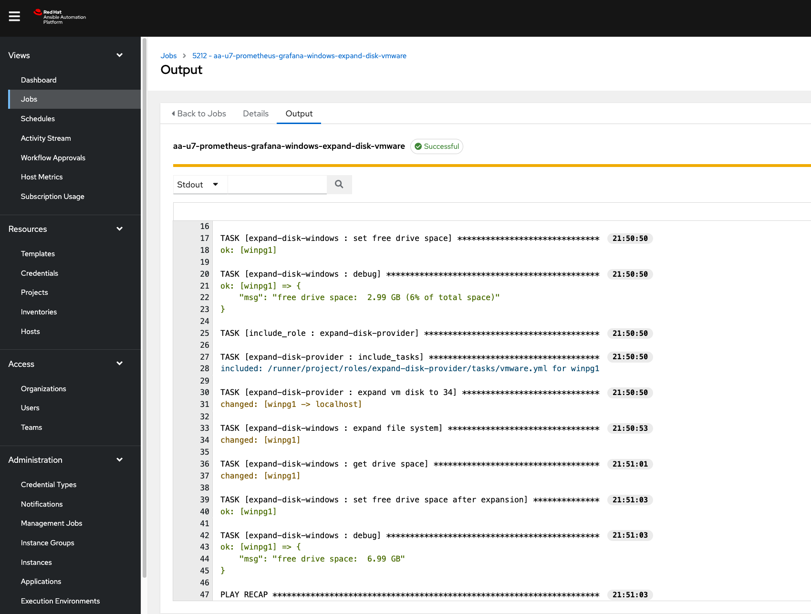

# Prometheus and Grafana Deployment with Ansible Automation Platform

This is a comprehensive set of playbooks that provisions infrastructure for Prometheus and Grafana, installs and configures them, and sets up alerting and visualization. The playbook consists of three main parts:
### Infrastructure Provisioning

This part uses Ansible to provision two nodes:

* `prometheus_node`: A Linux node running Prometheus.
* `windows_node`: A Windows node that will run the Node Exporter.

These nodes are provisioned using various cloud providers (e.g., VMware, OpenShift Virtualization (Kubevirt), oVirt, and EC2).

### Playbooks
1. [prograf_infra_multi.yml](prograf_infra_multi.yml) - Provisions the infrastructure nodes.
2. [prograf_provision.yml](prograf_provision.yml) - Installs and configures Prometheus and Grafana on the linux node.
3. [prograf_windows_exporter.yml](prograf_windows_exporter.yml) - Installs and configures Node Exporter on the Windows node.
4. [prograf_windows_add_to_prometheus.yml](prograf_windows_add_to_prometheus.yml) - Add the Windows node to Prometheus for monitoring.
5. [ap_app_token.yml](ap_app_token.yml) - Receive application token from Ansible Automation Platform for integration.
6. [aap_metrics_monitor.yml](aap_metrics_monitor.yml) - This playbook optionally enables monitoring Ansible Automation Platform's usage information in Grafana.
7. [prograf_aap_self_heal.yml](prograf_aap_self_heal.yml) - This playbook creates a webhook service to interface with Ansible Automation Platform to auto remidiate the issue's by running an Ansible automation job which increases the size of the disk and then the filesystem on the Windows node.
8. [windows_fill_disk.yml](windows_fill_disk.yml) - This playbook simulates filling up the disk so that an alert is fired and automatically remediated on the Windows node.

### Ansible Automation Platform (AAP) Workflow to test this scenario

### Grafana Dashboard showing the Windows Node

### Auto-remediation on AAP

### Features

* Alerting: Set up alerting in Prometheus using the Node Exporter, which monitors disk usage on the Windows node.
* Visualization: Configure Grafana to visualize usage information from Ansible Automation Platform.
* Remediation: When the disk fills up on the Windows node, the playbook uses a job template in Ansible Automation Platform to increase the disk size.

### Prerequisites

1. Ansible Automation Platform installed and configured.
2. Cloud provider credentials set up for infrastructure provisioning (e.g., VMware, OpenShift Virtualization (Kubevirt), oVirt, and EC2).

### Getting Started

To use this playbook, follow these steps:

1. Clone the repository containing the playbooks and roles.
2. Update the playbook variables to match your environment (e.g., cloud provider, node names).
3. Run the playbooks as listed above

### Note

This playbook is designed for testing and demonstration purposes only. Please use caution when running it in production, as it may cause data loss or other issues if not properly tested and validated.
